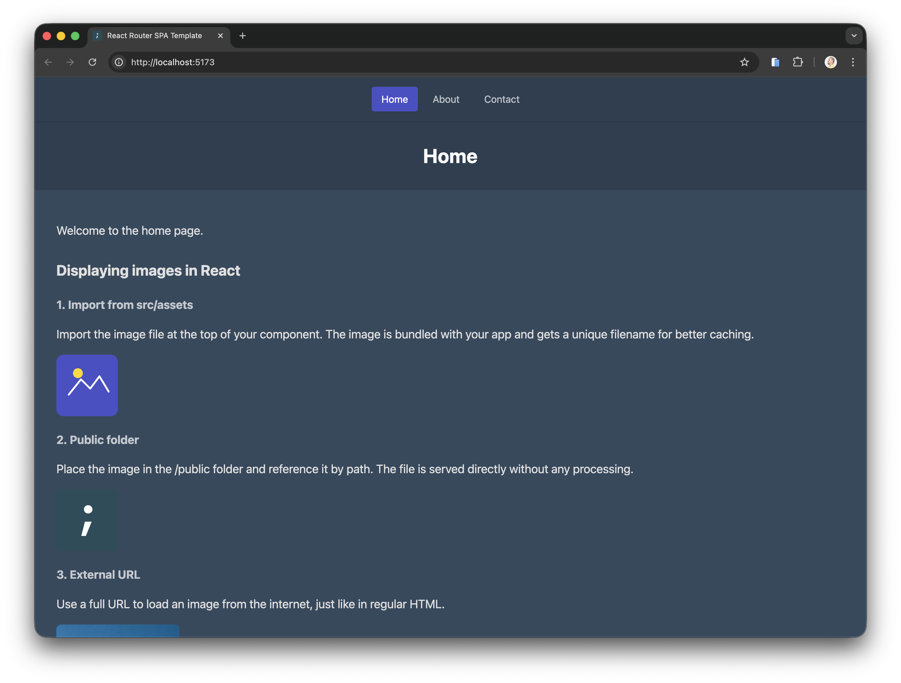

# GitHub Pages uden starter-template

Brug denne guide, hvis jeres Vite + React projekt ikke er lavet ud fra starter-templaten, men stadig skal deployes til GitHub Pages.

I skal kun bruge VS Code-terminalen til nogle få `npm` kommandoer. Commit og push klares med VS Code Source Control eller GitHub Desktop.

## 1. Test appen lokalt

Åbn projektet i VS Code, og vælg **Terminal** -> **New Terminal**.

```bash
npm install
npm run dev
```

Åbn den lokale URL, typisk `http://localhost:5173`.



Kør også:

```bash
npm run build
```

Hvorfor: Hvis projektet ikke kan buildes lokalt, vil GitHub Pages heller ikke kunne deploye det.

## 2. Tjek repository-navn og branch

Find:

- repository-navnet på GitHub
- branch-navnet i GitHub Desktop eller VS Code, typisk `main`

Repository-navnet skal bruges i `base`. Branch-navnet skal matche workflowet senere.

Tjek også, at projektet har både `package.json` og `package-lock.json`. Hvis `package-lock.json` mangler, kør:

```bash
npm install
```

Commit derefter `package-lock.json` med VS Code Source Control eller GitHub Desktop.

## 3. Opdater package.json

GitHub Pages viser typisk projektet på:

```text
https://brugernavn.github.io/repository-navn/
```

Derfor skal Vite kende repository-navnet.

I `package.json`: tilføj et nyt felt, der hedder `base`.

Sæt `base` til repository-navnet med `/` før og efter. Opdatér også gerne `name`, så det matcher repository-navnet uden skråstreger. `name` er ikke afgørende for deployment, men det gør projektet lettere at genkende.

```json
{
  "name": "portfolio-app",
  "base": "/portfolio-app/",
  "version": "1.0.0"
}
```

Hvis repository hedder `brugernavn.github.io`, skal `base` være `"/"`.


## 4. Opdater vite.config.js

Åbn `vite.config.js`. Hvis filen ikke findes, så opret den i projektets rodmappe.

Indsæt koden herunder, eller tilpas jeres eksisterende fil, så den indeholder `base`-linjen.

Den vigtige del er:

```js
base: command === "serve" ? "/" : pkg.base
```

Eksemplet herunder er en minimal standardfil. Hvis I allerede har anden konfiguration i `vite.config.js`, så behold den og tilføj kun `base`-linjen i objektet.

```js
import { defineConfig } from "vite";
import react from "@vitejs/plugin-react";
import pkg from "./package.json";

export default defineConfig(({ command }) => {
  return {
    plugins: [react()],
    base: command === "serve" ? "/" : pkg.base
  };
});
```

Hvorfor: Lokalt bruger appen `/`, men på GitHub Pages ligger den normalt i `/repository-navn/`.

## 5. Tjek React Router

Hvis appen har undersider som `/about`, `/contact` eller `/posts`, skal React Router også kende `base`.

Tjek først, at `react-router` står under `dependencies` i `package.json`. Hvis pakken mangler:

```bash
npm install react-router
```

I `src/main.jsx`: tilføj `basename={import.meta.env.BASE_URL}` til `BrowserRouter`.

```jsx
import { StrictMode } from "react";
import { createRoot } from "react-dom/client";
import { BrowserRouter } from "react-router";
import "./styles.css";
import App from "./App.jsx";

createRoot(document.getElementById("root")).render(
  <StrictMode>
    <BrowserRouter basename={import.meta.env.BASE_URL}>
      <App />
    </BrowserRouter>
  </StrictMode>
);
```

Brug `Link` eller `NavLink` fra `react-router` til interne links:

```jsx
import { Link, NavLink } from "react-router";
```

Hvorfor: Almindelige `<a href="/about">` kan give 404 på GitHub Pages.

## 6. Tjek billeder og filer

Billeder fra `src/assets` importeres i komponenten:

```jsx
import logo from "./assets/logo.svg";

;
```

Filer fra `public/` skal bruge `import.meta.env.BASE_URL`:

```jsx
const logoUrl = `${import.meta.env.BASE_URL}logo.webp`;

;
```

Hvorfor: Ellers kan billeder virke lokalt, men mangle på GitHub Pages.

## 7. Opret deploy.yml

Opret denne fil i VS Code:

```text
.github/workflows/deploy.yml
```

Indsæt:

```yaml
name: Deploy static content to Pages

on:
  push:
    branches: ["main"]
  workflow_dispatch:

permissions:
  contents: read
  pages: write
  id-token: write

concurrency:
  group: "pages"
  cancel-in-progress: true

jobs:
  deploy:
    environment:
      name: github-pages
      url: ${{ steps.deployment.outputs.page_url }}
    runs-on: ubuntu-latest
    steps:
      - name: Checkout
        uses: actions/checkout@v6

      - name: Set up Node
        uses: actions/setup-node@v6
        with:
          node-version: 24
          cache: "npm"

      - name: Install dependencies
        run: npm ci

      - name: Build
        run: npm run build

      - name: Copy index.html to 404.html for SPA routing
        run: cp ./dist/index.html ./dist/404.html

      - name: Setup Pages
        uses: actions/configure-pages@v6

      - name: Upload artifact
        uses: actions/upload-pages-artifact@v5
        with:
          path: "./dist"

      - name: Deploy to GitHub Pages
        id: deployment
        uses: actions/deploy-pages@v5
```

Hvis jeres branch ikke hedder `main`, ret `branches: ["main"]`.

Hvorfor `404.html`: Det gør, at React Router virker, når man refresher eller åbner en underside direkte.

## 8. Aktivér GitHub Pages

På GitHub:

1. Gå til **Settings**.
2. Klik **Pages**.
3. Sæt **Source** til **GitHub Actions**.
4. Aktivér **Enforce HTTPS**, hvis indstillingen vises.


## 9. Commit og sync

Commit ændringerne:

- `package.json`
- `vite.config.js`
- `src/main.jsx`, hvis I bruger React Router
- `.github/workflows/deploy.yml`

I VS Code Source Control:

1. Skriv en commit-besked, fx `Set up GitHub Pages deployment`.
2. Klik **Commit**.
3. Klik **Sync Changes**.

I GitHub Desktop:

1. Skriv en commit-besked.
2. Klik **Commit to main**.
3. Klik **Push origin** eller **Sync Changes**.


## 10. Verificér deployment

1. Åbn **Actions** på GitHub.
   
2. Vent til workflowet er færdigt.
   
3. Åbn deployment-URL'en.
   
4. Test forsiden.
   
5. Test en underside, fx `/about`.
6. Refresh undersiden.

Deployment er klar, når både forsiden og undersider virker.

## 11. Test med en lille ændring

1. Ret en synlig tekst i fx `src/pages/HomePage.jsx`.
2. Commit og klik **Sync Changes** eller **Push origin**.
3. Vent på et nyt grønt workflow under **Actions**.
4. Opdatér live-siden og tjek, at ændringen er synlig.

Tip: Deployment tager normalt 1-3 minutter.

## Hurtig fejlfinding

Blank side:

- Tjek `base` i `package.json`.
- Tjek `base` i `vite.config.js`.

404 på undersider:

- Tjek `basename={import.meta.env.BASE_URL}`.
- Tjek at workflowet kopierer `dist/index.html` til `dist/404.html`.

Workflowet starter ikke:

- Tjek at GitHub Pages source står til **GitHub Actions**.
- Tjek at workflowets branch matcher jeres branch.
- Tjek at I har klikket **Sync Changes** eller **Push origin**.

`npm ci` fejler:

- Tjek at `package-lock.json` er committet.

---

## Næste skridt

Hvis deployment virker, fortsæt med [collaboration-guide.md](collaboration-guide.md).

## Kilder

- GitHub Docs: [Configuring a publishing source for your GitHub Pages site](https://docs.github.com/en/pages/getting-started-with-github-pages/configuring-a-publishing-source-for-your-github-pages-site)
- GitHub Docs: [Using custom workflows with GitHub Pages](https://docs.github.com/en/pages/getting-started-with-github-pages/using-custom-workflows-with-github-pages)
- Vite Docs: [Deploying a static site - GitHub Pages](https://vite.dev/guide/static-deploy.html#github-pages)
- React Router Docs: [BrowserRouter](https://reactrouter.com/api/declarative-routers/BrowserRouter)
